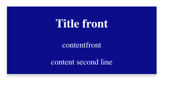

<!-- README.md is generated from README.Rmd. Please edit that file -->

# flashCard 

<!-- badges: start -->
[](https://cran.r-project.org/package=flashCard)
[](https://cranlogs.r-pkg.org/badges/grand-total/flashCard)
<!-- badges: end -->

Here is a Shiny demo repo: https://github.com/jienagu/flashCard_Shiny_Demo

Live Demo on shinyapp.io: https://appforiarteam.shinyapps.io/flashCard_demo/

Live podcast tutorial on 32:38 : https://shinydevseries.com/post/episode-16-jmclellan/


## Installation

``` r
install.packages("flashCard")
```

This is package is to create a flash card for Shiny application with
desired data.frame.

## Introduction

Simply create a data frame with `front` column and `back` column. Then
put this data frame into `flashCard()` function, we will get a nice
flash card.

``` r
library(flashCard)
df1 <- data.frame(
  front = c("Title front","contentfront", "content second line"),
  back =c("Title back","content back", "second line")
)
flashCard(df1, elementId = "card", front_text_color = "white")
```



## Feature update

Users can use `text_align` to customize text alignment in the flash Card, please use developer version (v0.1.1) to test it out!

Dev version installation

``` r
devtools::install_github("jienagu/flashCard")
```

``` r
library(flashCard)
df1 <- data.frame(
  front = c("Title front","contentfront", "content second line"),
  back =c("Title back","content back", "second line")
)
flashCard(df1, elementId = "card", front_text_color = "white", text_align = "left", 
          width = "300px")

```


## App examples


* Ganapathy Palanimuthu's Flash Card App repo: https://github.com/ganapap1/FlashCard/tree/main.  YouTube Demo: https://www.youtube.com/watch?v=x59NfU0NsRw


